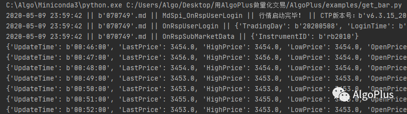
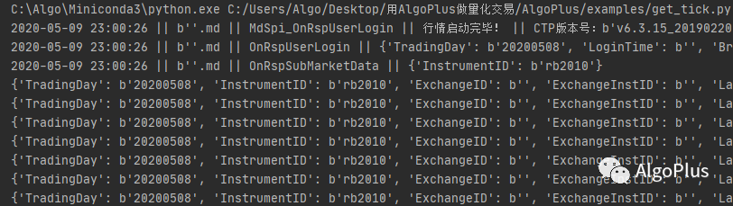
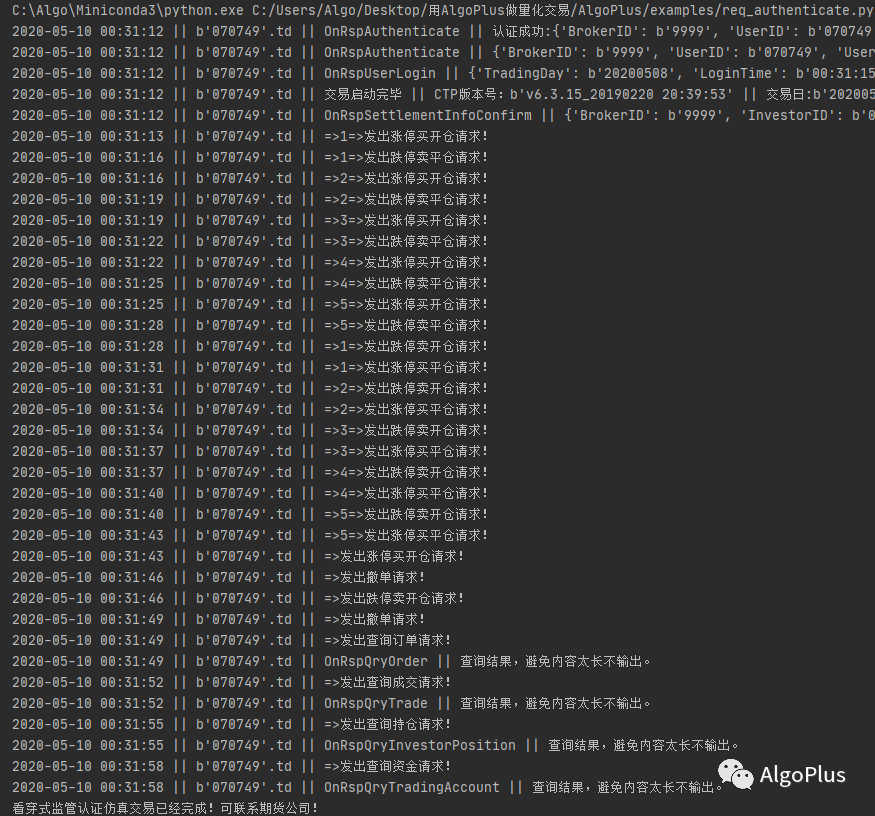
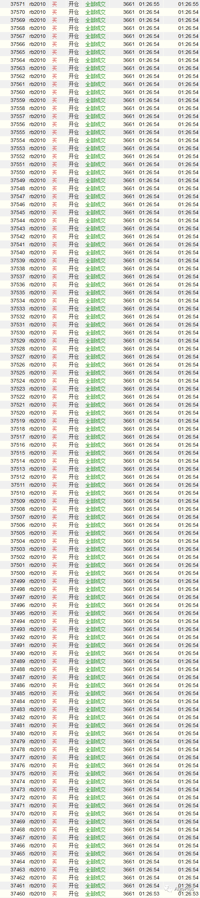

```
如无必要，勿增实体
```

# 简介
AlgoPlus是上期技术CTP API的Python封装，具有以下特点：
* **易使用**：Python语言，结构清晰，注释完整，文档详尽。
* **低延时**：基于Cython释放GIL；支持多路行情源；无需主事件引擎，实现去中心化。
* **忠实于CTP官方特性**：充分利用CTP的异步、多线程特性。

# 官网
<http://algo.plus>

# 安装
首先配置[Anaconda环境](http://algo.plus/algoplus/getting-started/installation.html)，然后使用pip命令安装：
```
pip install AlgoPlus
```

# 入门视频教程
* [配置Python环境与安装AlgoPlus](https://www.zhihu.com/zvideo/1288264124560662528)
* [CTP API的工作原理](https://www.zhihu.com/zvideo/1288267321451081728)

# 应用范例

这里就给大家介绍介个基于AlgoPlus实现的应用范例，供大家参考。

## 1、获取实时行情
发布实时行情是交易所实现价值发现职能的重要工作，而且是交易决策的重要依据。

CTP通过一个独立的MdApi接口发布行情。MdApi功能比较单一，只需要在与服务器建立连接后订阅相关合约，就可以自动接收到到实时行情。

AlgoPlus对MdApi进行了封装，我们只需要将账户信息及合约名称作为参数传进去，就可以接收到字典形式的实时行情数据。

演示这个功能的例子是`examples/get_tick.py`，运行之后可以看到如下的输出结果：



从输出日志可以看到，AlgoPlus第一步连接服务器，第二步登陆账户，第三步订阅行情，最后就是接收行情数据。

### 1.1 期货合约规范：
* 上期/能源所：小写+4个数字
* 大商所：小写+4个数字
* 中金所：大写+4个数字
* 郑商所：大写+3个数字

### 1.2 期权合约规范：
* 上期所/能源所：小写+4个数字+C(或者P)+行权价
* 郑商所：大写+3个数字+C(或者P)+行权价
* 中金所：大写+4个数字+-C-(或者-P-)+行权价
* 大商所：小写+4个数字+-C-(或者-P-)+行权价

## 2、将行情存为CSV文件
因为MdApi只推送实时行情，所以存储数据是量化交易至关重要的一项工作。虽然有多种数据库可以选择，但是简单起见，`examples/tick_to_csv.py`使用了csv文件。运行这个例子后，实时行情数据自动被存入`MarketData`文件夹下的csv文件中。

## 3、合成K线
MdApi推送的实时行情是固定时间间隔（一般间隔是500ms）的快照，也就是我们常说Tick数据。

而交易决策的逻辑基础往往是K线数据，所谓的K线就是用固定时间间隔内开盘价、最高价、最低价、收盘价代理此间所有Tick。

K线自诞生以来就被二级市场所广泛使用。合理的选择K线周期，可以帮助我们抓住主线趋势，避免陷于短期波动。

`examples/get_bar.py`为大家演示了如何将Tick数据合成1分钟K线数据，字段内容如下：

```python
{
    'InstrumentID': b'', # 合约代码
    'UpdateTime': b'00:46:00', # K线开始时间
    'LastPrice': 3454.0, # 收盘价
    'HighPrice': 3454.0, # 最高价
    'LowPrice': 3454.0, # 最低价
    'OpenPrice': 3454.0, # 开盘价
    'BarVolume': 7, # 成交量
    'BarTurnover': 24178.0, # 成交额
    'BarSettlement': 3454.0, # K线成交均价
    'BVolume': 0, # 主动买量
    'SVolume': 7, # 主动卖量
    'FVolume': 0, # 非主动买卖量
    'DayVolume': 1381157, # 全天成交量
    'DayTurnover': 4771897578.0, # 全天成交额
    'DaySettlement': 3455.000103536383, # 全天成交均价
    'OpenInterest': 1577415.0, # 持仓量
    'LastVolume': 1381157, # 全天成交量
    'TradingDay': b'20200508' # 交易日
}
```

除了1分钟K线之外，大家也可以参考如下条件合成其他周期K线：

```python
# 1分钟K线条件
is_new_1minute = (pDepthMarketData['UpdateTime'][:-2] != last_update_time[:-2]) and pDepthMarketData['UpdateTime'] != b'21:00:00'
# 5分钟K线条件
is_new_5minute = is_new_1minute and int(pDepthMarketData['UpdateTime'][-4]) % 5 == 0
# 10分钟K线条件
is_new_10minute = is_new_1minute and pDepthMarketData['UpdateTime'][-4] == b"0"
# 15分钟K线条件
is_new_10minute = is_new_1minute and int(pDepthMarketData['UpdateTime'][-5:-3]) % 15 == 0
# 30分钟K线条件
is_new_30minute = is_new_1minute and int(pDepthMarketData['UpdateTime'][-5:-3]) % 30 == 0
# 60分钟K线条件
is_new_hour = is_new_1minute and int(pDepthMarketData['UpdateTime'][-5:-3]) % 60 == 0
```

运行结果如下：



## 4、看穿式认证
由于监管要求，接入期货公司的交易程序必须经过看穿式认证。简单的说，就是用交易程序在期货公司提供的仿真环境中完成指定的交易、查询任务就可以了。完成后，期货公司会提供用于生产环境的授权码。所谓的直连模式和中继模式，只要是自己用的都属于直连模式。

`examples/req_authenticate.py`这个例子虽然是为了方便大家做认证，但是其中的基础操作对熟悉交易接口是很有帮助的，例如：

```python
# 买开仓
self.buy_open(...)
# 卖平仓
self.sell_close(...)
# 卖开仓
self.sell_open(...)
# 买平仓
self.buy_close(...)
# 撤单
self.req_order_action(...)
# 查询订单
self.req_qry_order(...)
# 查询成交
self.req_qry_trade()
# 查询持仓
self.req_qry_investor_position()
# 查询资金
self.req_qry_trading_account()
```

需要注意的是交易接口的查询功能是有流控限制的，每秒限制只能查询1次。买卖报单以及撤单不受流控限制。



## 5、滚动交易

延时是很多量化交易会关注的问题，但是这又是一个很复杂的问题。

为了简单起见，我们设计了`examples/rolling_trade.py`这个滚动交易策略：收到前次报单成交回报时发起新的交易请求。完成300次交易之后，我们统计一下1秒内的交易次数，就可以计算出交易环境的延时，包括网络、交易程序、期货公司系统、交易所系统总的用时。

我使用simnow的7*24测试环境在阿里云服务器上运行该例子，1s内完成110笔成交。但是，需要说明的是，这个数据并不真实，因为7*24测试环境负载非常低。建议大家在正常的交易时间使用simnow仿真环境测试，可以获得相对更有价值的数据。



## 6、盈损管理

`examples/profit_loss_manager.py`是一个相对复杂的例子，启动后可以监控账户的所有的成交，包括从快期或者其他终端软件报的单，当达到止盈止损条件时，就会自动平仓。启动前需要设置好止盈止损参数：

```python
pl_parameter = {
    'StrategyID': 9,
    # 盈损参数，'0'代表止盈, '1'代表止损，绝对价差
    'ProfitLossParameter': {
        b'rb2010': {'0': [2], '1': [2]},
        b'ni2007': {'0': [20], '1': [20]},
    },
}
```

简单起见，这里只实现了固定止盈止损，大家可以参考实现更复杂、有效的止损策略。这篇文章为大家提供一些关于止盈止损的思路：[http://algo.plus/researches/0002.html](http://algo.plus/researches/0002.html)

另外，我们也可以将这个策略部署到服务器上，成为属于自己的云端条件单系统。

因为目的是为了让大家快速熟悉AlgoPlus，所以很多问题都浅尝辄止，以后有机会我们再进行深入探讨，也欢迎大家在后台留言讨论。

## 7、订阅全市场行情并落地为csv文件

期货合约都是有期限的，订阅全市场行情需要先使用`AlgoPlus.CTP.TraderApi.req_instrument`查询当前挂牌交易的所有合约，然后再交给`run_mdrecorder`订阅并存储。`subscribe_all.py`演示了具体如何使用。

# 开源地址
1. 码云：<https://gitee.com/AlgoPlus/>
2. GitHub：<https://github.com/keyalgo/AlgoPlus>

### QQ群与微信公众号
 * QQ群：**866469866**
 


 * 微信公众号：**AlgoPlus**
 


# 版权
MIT